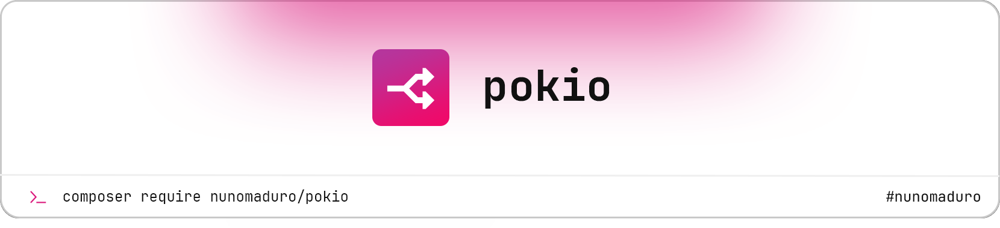

<a href="https://nunomaduro.com/">
  <picture>
    <source media="(prefers-color-scheme: dark)" srcset="art/header-dark.png">
    
  </picture>
</a>

# Pokio

<p>
    <a href="https://github.com/nunomaduro/pokio/actions"></a>
    <a href="https://packagist.org/packages/nunomaduro/pokio"></a>
    <a href="https://packagist.org/packages/nunomaduro/pokio"></a>
    <a href="https://packagist.org/packages/nunomaduro/pokio"></a>
</p>

**Pokio** is a dead simple **PHP Asynchronous** API that just works! Here is an example:

```php
$promiseA = async(fn () () {
    sleep(2);
    
    return 'Task 1';
});

$promiseB = async(function () {
    sleep(2);
    
    return 'Task 2';
});

// just takes 2 seconds...
[$resA, $resB] = await([$promiseA, $promiseB]);

echo $resA; // Task 1
echo $resB; // Task 2
```

## Installation

> **Requires [PHP 8.3+](https://php.net/releases/)**.

> **Note:** This package is a **work in progress (don't use it yet)**.

⚡️ Get started by requiring the package using [Composer](https://getcomposer.org):

```bash
composer require nunomaduro/pokio:@dev
```

## Usage

```php
$promiseA = async(function () {
    sleep(2);
    
    return 'Task 1';
});

$promiseB = async(function () {
    sleep(2);
    
    return 'Task 2';
});

// just takes 2 seconds...
[$resA, $resB] = await([$promiseA, $promiseB]);

echo $resA; // Task 1
echo $resB; // Task 2
```

## Follow Nuno

- Follow the creator Nuno Maduro:
    - YouTube: **[youtube.com/@nunomaduro](https://www.youtube.com/@nunomaduro)** — Videos every weekday
    - Twitch: **[twitch.tv/enunomaduro](https://www.twitch.tv/enunomaduro)** — Streams (almost) every weekday
    - Twitter / X: **[x.com/enunomaduro](https://x.com/enunomaduro)**
    - LinkedIn: **[linkedin.com/in/nunomaduro](https://www.linkedin.com/in/nunomaduro)**
    - Instagram: **[instagram.com/enunomaduro](https://www.instagram.com/enunomaduro)**
    - Tiktok: **[tiktok.com/@enunomaduro](https://www.tiktok.com/@enunomaduro)**

## License

**Pokio** was created by **[Nuno Maduro](https://twitter.com/enunomaduro)** under the **[MIT license](https://opensource.org/licenses/MIT)**.
